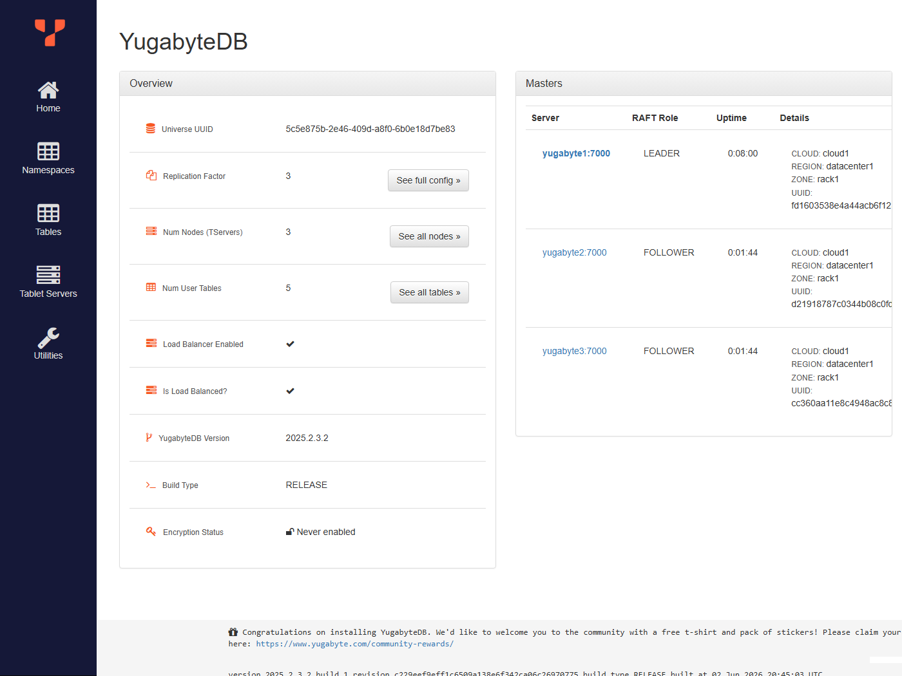
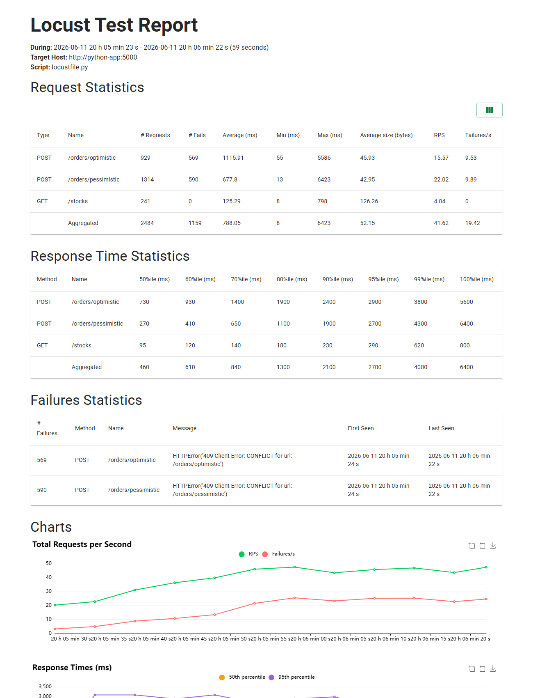
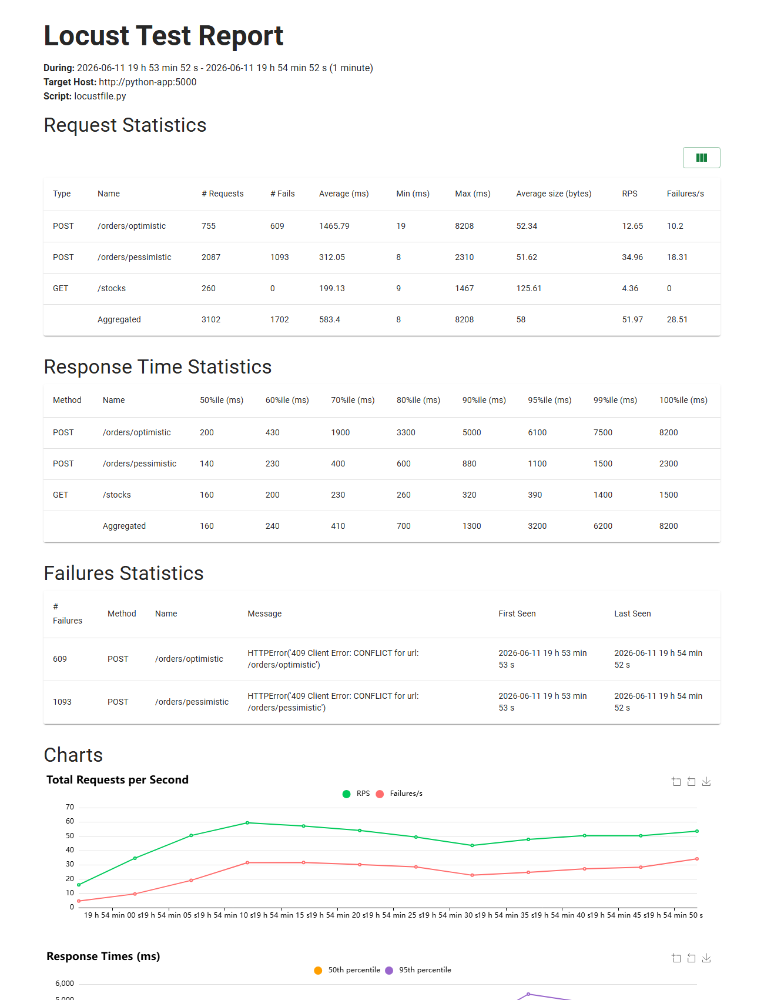
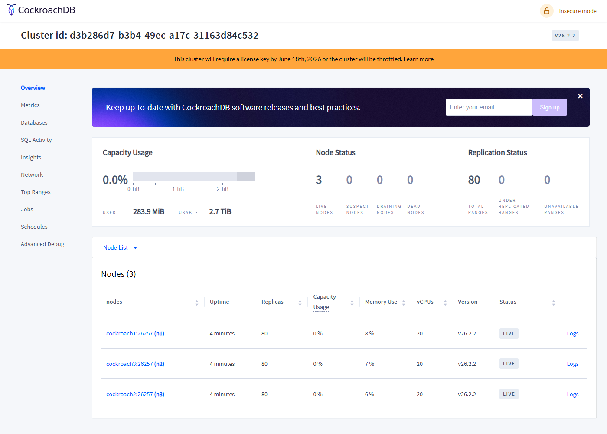
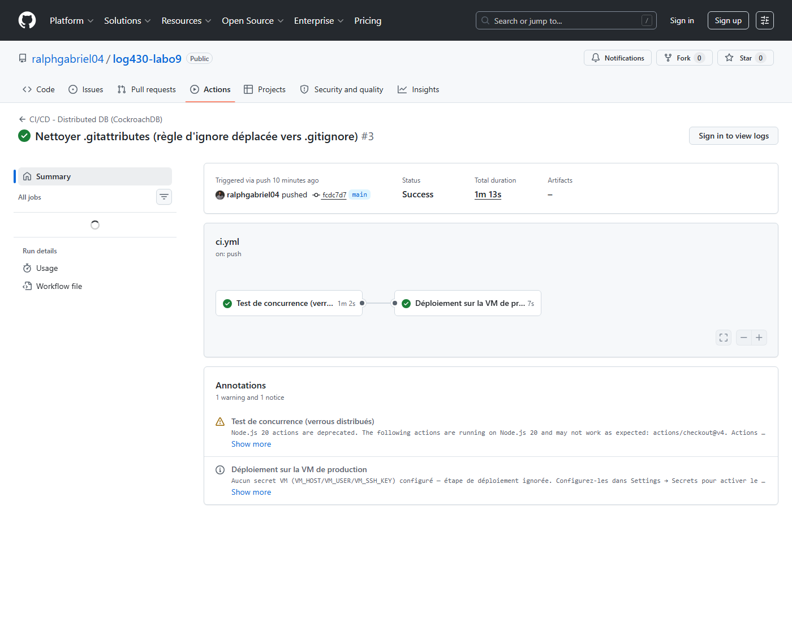

# Rapport — Labo 09 : Bases de données distribuées et verrous distribués

**Cours :** LOG430 — Architecture logicielle
**Auteur :** Ralph Gabriel
**Chargé de laboratoire :** Gabriel C. Ullmann

---

## Introduction

Dans ce labo, j'ai comparé deux bases de données distribuées open source, YugabyteDB et
CockroachDB, sous forte concurrence. Quatre choses m'intéressaient : comment les données se
répliquent dans un cluster à trois nœuds, comment se comportent deux stratégies de verrouillage
(pessimiste avec `SELECT … FOR UPDATE`, et optimiste avec une colonne `version`), quel débit et
quel taux d'erreurs on obtient sous charge, et ce qui se passe quand un nœud tombe.

L'application est une version réduite de *Store Manager* : une API Flask avec deux endpoints de
création de commande, `/orders/pessimistic` et `/orders/optimistic`, qui décrémentent le stock
d'un article.

---

## Architecture du projet

```
Client / Test (concurrency_test.py, Locust)
        │  HTTP POST /orders/{pessimistic|optimistic}
        ▼
   App Flask (python_app, port 5000)
        │  SQLAlchemy + psycopg2 (protocole PostgreSQL)
        ▼
   Cluster distribué (3 nœuds)
   ┌───────────┬───────────┬───────────┐
   │ yugabyte1 │ yugabyte2 │ yugabyte3 │   réplication + consensus Raft
   └───────────┴───────────┴───────────┘
```

Quelques points à retenir :

- yugabyte1 est joignable en YSQL (port 5433). Les tables sont découpées en *tablets* répartis
  entre les nœuds.
- Le conteneur `db-init` exécute `init.sql` (tables + données de test) puis s'arrête. C'est
  normal, il a juste fini son travail.
- L'article numéro 3 (« Gadget XYZ ») démarre avec un stock de 2 unités. C'est lui qui sert de
  cobaye pour tester les verrous, parce qu'avec un stock aussi bas la moindre faille de
  verrouillage se voit tout de suite.

### Les deux stratégies de verrouillage (`order_controller.py`)

Le verrouillage pessimiste, dans `create_order_pessimistic` :
```python
stock = session.query(Stock).filter(Stock.product_id == pid).with_for_update().one_or_none()
```
La ligne de stock est verrouillée dès la lecture. Une autre transaction qui veut la même ligne
attend que la première se termine (commit ou rollback). C'est imparable contre la survente, mais
ça coûte de la latence dès qu'il y a de la contention.

Le verrouillage optimiste, dans `create_order_optimistic` :
```python
# 1. lire quantité + version (sans verrou)
# 2. UPDATE stocks SET quantity=:q, version=version+1 WHERE product_id=:pid AND version=:old
if result.rowcount == 0:      # une autre transaction a déjà modifié la ligne
    session.rollback()        # on recommence (jusqu'à max_retries)
```
Ici, aucun verrou à la lecture. Le conflit se détecte au moment d'écrire : si la `version` a
changé entre-temps, l'`UPDATE` ne touche aucune ligne et on recommence. C'est efficace tant que
les conflits restent rares.

---

## Question 1 — Distribution des données entre les nœuds

> *Quelle est la sortie du terminal ? La sortie est-elle identique sur yugabyte1, yugabyte2 et yugabyte3 ?*

Avant le test, la table `orders` est vide partout :
```
$ ysqlsh -h yugabyte1 -U yugabyte -c "SELECT * FROM orders;"
 id | user_id | total_amount | payment_link | is_paid | created_at
----+---------+--------------+--------------+---------+------------
(0 rows)
```

J'ai ensuite lancé `python tests/concurrency_test.py --threads 5 --product 3`. Les deux
stratégies acceptent exactement 2 commandes (le stock de départ de l'article 3 vaut 2) et en
refusent 3 avec un HTTP 409.

Après le test, la même requête sur les trois nœuds donne exactement la même sortie :
```
yugabyte1 │ yugabyte2 │ yugabyte3   (sortie identique sur les 3)
 id  | user_id | total_amount
-----+---------+--------------
   1 |       2 |         5.75
   2 |       2 |         5.75
   3 |       3 |         5.75
 101 |       3 |         5.75
(4 rows)
```

La sortie est donc identique d'un nœud à l'autre. C'est exactement ce qu'on attend d'une base
distribuée : YugabyteDB réplique les écritures via le consensus Raft, et peu importe le nœud
qu'on interroge, on lit le même état. Un détail intéressant : les `id` ne se suivent pas
(1, 2, 3, puis 101). C'est la signature de l'allocation de clés `SERIAL` en distribué, où chaque
nœud reçoit sa propre plage de valeurs pour éviter de se battre sur un compteur unique.



*Console YB-Master. On voit le facteur de réplication à 3, les 3 TServers, et surtout les rôles
Raft : `yugabyte1` est LEADER, `yugabyte2` et `yugabyte3` sont FOLLOWER. C'est ce nœud leader qui
coordonne le consensus et garantit que les 3 nœuds renvoient le même état.*

---

## Question 2 — Latence pessimiste vs optimiste (20 threads)

> *Quelle approche a la latence moyenne la plus élevée et pourquoi ?*

Test : `python tests/concurrency_test.py --threads 20 --product 3` (article 3, stock = 2).

| Stratégie | Succès | Échecs | Latence moy. (succès) | Latence moy. (échecs) | Latence moy. (totale) |
|-----------|:------:|:------:|:---------------------:|:---------------------:|:---------------------:|
| Pessimiste (`SELECT … FOR UPDATE`) | 2 | 18 | 2.026 s | 2.652 s | **2.589 s** |
| Optimiste (version + `UPDATE`) | 2 | 18 | 1.108 s | 2.066 s | **1.970 s** |

Le stock final de l'article 3 est bien à 0, donc aucune survente :
```
$ curl http://localhost:5000/stocks
[{"product_id":1,"quantity":1000},{"product_id":2,"quantity":500},
 {"product_id":3,"quantity":0},{"product_id":4,"quantity":90}]
```

C'est le pessimiste qui a la latence moyenne la plus élevée, 2.589 s contre 1.970 s. La raison
tient au verrou. Avec `SELECT … FOR UPDATE`, les 20 transactions visent toutes la même ligne et
se retrouvent sérialisées : chacune attend que la précédente relâche le verrou. Elles forment une
file, et la latence s'accumule au fil de la file (le dernier thread attend tous les autres). Côté
optimiste, il n'y a pas d'attente : une transaction perdante voit tout de suite que le stock est
épuisé (`rowcount = 0`, puis 409) et rend la main sans rester bloquée. D'où une moyenne plus
basse.

---

## Question 3 — Latence pessimiste vs optimiste (5 threads)

> *Avec 5 threads, quelle approche a la latence moyenne la plus élevée et pourquoi ?*

Test : `python tests/concurrency_test.py --threads 5 --product 3`.

| Stratégie | Succès | Échecs | Latence moy. (succès) | Latence moy. (échecs) | Latence moy. (totale) |
|-----------|:------:|:------:|:---------------------:|:---------------------:|:---------------------:|
| Pessimiste | 2 | 3 | 0.908 s | 1.165 s | **1.062 s** |
| Optimiste  | 2 | 3 | 0.320 s | 0.499 s | **0.427 s** |

Même verdict qu'à la Q2 : le pessimiste reste le plus lent, 1.062 s contre 0.427 s, et pour la
même raison (la sérialisation sur la ligne partagée). Ce qui change, c'est l'échelle. Avec
seulement 5 threads, la contention est plus faible et les latences absolues chutent fortement
(1.062 s ici contre 2.589 s avec 20 threads en pessimiste). L'écart entre les deux stratégies,
lui, ne disparaît pas : l'attente de verrou pénalise toujours le pessimiste.

---

## Comment fonctionne le test de charge (Locust)

Avant les résultats, un mot sur la mécanique du test, parce qu'elle explique la forme des
chiffres. Le `locustfile.py` définit deux profils d'utilisateur de poids égal,
`PessimisticOrderUser` et `OptimisticOrderUser`. Locust répartit donc les 50 utilisateurs à peu
près moitié-moitié entre les deux endpoints. Chaque utilisateur attend entre 0.1 et 0.5 s entre
deux requêtes (`wait_time = between(0.1, 0.5)`) et passe une commande d'un article tiré au hasard
parmi les quatre, dix fois plus souvent qu'il ne consulte `/stocks` (`@task(10)` contre
`@task(1)`). Au démarrage du test, un *listener* `on_test_start` remet les stocks à leur valeur
initiale, pour que chaque run parte du même état.

Les paramètres sont identiques pour tous les tests de charge de ce rapport : 50 utilisateurs,
spawn rate de 5/s, durée de 60 s. C'est ce qui rend la comparaison YugabyteDB / CockroachDB
honnête : seule la base de données change.

---

## Question 4 — Test de charge Locust sur YugabyteDB

> *Quelle stratégie affiche le plus bas taux d'erreurs et la plus basse latence moyenne ?*

Paramètres Locust : 50 utilisateurs, spawn rate 5/s, durée 60 s.

| Endpoint | Requêtes | Échecs | Taux d'erreur | Latence moy. | Médiane | Débit (req/s) |
|----------|:--------:|:------:|:-------------:|:------------:|:-------:|:-------------:|
| `POST /orders/pessimistic` | 741 | 297 | 40.1 % | 1175 ms | 530 ms | 13.80 |
| `POST /orders/optimistic`  | 493 | 263 | 53.3 % | 1981 ms | 1200 ms | 9.18 |
| `GET /stocks` | 123 | 0 | 0.0 % | 308 ms | 180 ms | 2.29 |
| Agrégé | 1357 | 560 | 41.2 % | 1389 ms | 800 ms | 25.27 |

Une précision importante avant de conclure : ces « échecs » sont des HTTP 409 légitimes (stock
épuisé sur les articles 3 et 4, ou réessais optimistes épuisés), pas des pannes d'infrastructure.
Le `GET /stocks` ne tombe jamais en erreur. Le taux reste quand même utile pour comparer les deux
stratégies entre elles.

Sur YugabyteDB, c'est le pessimiste qui gagne, et sur les deux tableaux : moins d'erreurs
(40.1 % contre 53.3 %) et latence plus basse (1175 ms contre 1981 ms), avec un débit supérieur en
prime (13.8 contre 9.2 req/s).

Ce résultat m'a d'abord surpris, parce qu'à la Q2 le pessimiste était le plus lent. La différence
vient du type de charge. En *burst* sur une seule ligne, le pessimiste paie son attente de verrou.
En charge soutenue répartie sur quatre articles, c'est l'optimiste qui se met à souffrir : chaque
conflit de `version` relance la transaction jusqu'à cinq fois, et finit en 409 si les tentatives
sont épuisées. Le pessimiste, lui, met en file mais ne gaspille pas de travail, et n'échoue
vraiment que quand le stock est réellement à zéro.



*Rapport Locust (YugabyteDB), run illustratif. Le `/orders/pessimistic` reste plus rapide en
moyenne que `/orders/optimistic` (≈ 680 ms contre ≈ 1120 ms sur ce run), et tous les échecs sont
des HTTP 409 (le `GET /stocks` est à 0). Les valeurs absolues bougent d'un run à l'autre selon la
charge de la machine ; les chiffres de référence sont ceux du tableau ci-dessus, issus du run
initial.*

---

## Question 5 — Résilience du cluster YugabyteDB

> *Le taux d'erreur a-t-il augmenté à l'arrêt d'un nœud ? Combien de temps a duré le basculement ?*

Protocole : un test de charge continu (50 utilisateurs, spawn 5/s), un `docker stop yugabyte2`
pendant la charge, puis un `docker start yugabyte2`. J'ai activé `--csv-full-history` pour avoir
l'historique seconde par seconde et mesurer le basculement précisément.

Chronologie, avec t = 0 au moment de l'arrêt de yugabyte2 (21:47:22 UTC) :

| Temps relatif | Débit complété | Observation |
|:-------------:|:--------------:|-------------|
| t = −2 s | ~49 req/s | Régime normal, 3 nœuds |
| t = 0 s | `docker stop yugabyte2` | Arrêt du nœud secondaire |
| t ≈ +2 s à +17 s | ~0 req/s | Plus aucune requête ne se termine (compteur figé à 530). Raft ré-élit les *leaders* des tablets qui vivaient sur yugabyte2. |
| t ≈ +19 s à +28 s | 1 → 20 → 47 req/s | Reprise progressive sur les 2 nœuds restants (quorum 2/3) |
| t ≈ +37 s | `docker start yugabyte2` | Le nœud revient sans provoquer de nouvelle coupure |

Donc oui, le taux d'erreur a augmenté, mais de manière temporaire. Pendant une quinzaine de
secondes le débit est tombé à zéro (les requêtes en cours attendaient un nouveau *leader*), et les
timeouts se sont accumulés avant que tout reparte. Le basculement a duré environ 15 secondes.
Ensuite, le système est revenu à son débit normal d'à peu près 50 req/s en tournant sur seulement
2 nœuds, ce qui montre bien la haute disponibilité par quorum.

Le point que je trouve le plus parlant : la récupération s'est faite avant même que je redémarre
yugabyte2. Le cluster s'est rétabli tout seul après avoir perdu un nœud, et le redémarrage n'a
causé aucune coupure de plus. L'API Flask, elle, n'a jamais planté.

Sur l'ensemble du run (100 s, dont environ 37 s avec un nœud en moins) : 3885 requêtes et 1851
« échecs » (47.6 %, surtout des 409 plus les timeouts de la fenêtre de basculement). Le
`GET /stocks`, lui, n'a enregistré aucune erreur sur tout le run.

> Pourquoi environ 15 secondes ? Avec Raft, quand un nœud disparaît, chaque tablet dont le
> *leader* était sur ce nœud doit d'abord détecter la panne, puis élire un nouveau *leader* parmi
> les *followers*. Pendant cette ré-élection (à laquelle s'ajoute la reconnexion du pool de
> connexions côté application), les écritures sur ces tablets sont indisponibles. D'où le creux.

---

## Question 6 — Test de charge Locust sur CockroachDB

> *Quelle stratégie affiche le plus bas taux d'erreurs et la plus basse latence ?*

Mêmes paramètres qu'à la Q4 : 50 utilisateurs, spawn 5/s, 60 s.

| Endpoint | Requêtes | Échecs | Taux d'erreur | Latence moy. | Médiane | Débit (req/s) |
|----------|:--------:|:------:|:-------------:|:------------:|:-------:|:-------------:|
| `POST /orders/pessimistic` | 2106 | 1064 | 50.5 % | 290 ms | 140 ms | 35.81 |
| `POST /orders/optimistic`  | 811 | 654 | 80.6 % | 1229 ms | 230 ms | 13.79 |
| `GET /stocks` | 272 | 0 | 0.0 % | 168 ms | 160 ms | 4.63 |
| Agrégé | 3189 | 1718 | 53.9 % | 518 ms | 160 ms | 54.22 |

Sur CockroachDB le constat est le même que sur YugabyteDB, et il est encore plus tranché : le
pessimiste gagne avec un taux d'erreur de 50.5 % contre 80.6 %, une latence de 290 ms contre
1229 ms, et un débit nettement plus haut (35.8 contre 13.8 req/s). L'explication ne change pas :
sous charge soutenue, l'optimiste se noie dans ses réessais sur la colonne `version`, là où
CockroachDB, avec son isolation SERIALIZABLE par défaut, règle les conflits efficacement côté
verrou.

> J'ai aussi rejoué `concurrency_test --threads 20` sur CockroachDB pour vérifier : 2 commandes
> acceptées sur 20 et stock final à 0. Les verrous font bien leur travail là aussi.



*Rapport Locust (CockroachDB), run illustratif. Le débit agrégé (graphique « Total Requests per
Second ») tourne autour de 50 req/s, nettement au-dessus de YugabyteDB. Le `/orders/pessimistic`
reste plus rapide que `/orders/optimistic` et les seuls échecs sont des HTTP 409 (le `GET /stocks`
est à 0). Comme pour YugabyteDB, les valeurs absolues varient d'un run à l'autre ; les chiffres de
référence sont ceux du tableau ci-dessus.*

---

## Question 7 — Comparaison YugabyteDB vs CockroachDB

> *Quelle base de données affiche le plus bas taux d'erreurs et la plus basse latence ?*

Comparaison directe des deux tests de charge (60 s, 50 utilisateurs, spawn 5/s, locustfile
identique) :

| Métrique (agrégée) | YugabyteDB | CockroachDB | Meilleur |
|--------------------|:----------:|:-----------:|:--------:|
| Requêtes traitées (60 s) | 1357 | 3189 | CockroachDB |
| Débit moyen | 25.3 req/s | 54.2 req/s | CockroachDB (×2.1) |
| Latence moyenne | 1389 ms | 518 ms | CockroachDB (÷2.7) |
| Latence médiane | 800 ms | 160 ms | CockroachDB |
| Latence pessimiste | 1175 ms | 290 ms | CockroachDB |
| Taux d'erreur agrégé | 41.2 % | 53.9 % | YugabyteDB |
| Erreurs `GET /stocks` | 0 % | 0 % | égalité |

Et le *burst* (`concurrency_test --threads 20`, latence moyenne totale) :

| | YugabyteDB | CockroachDB |
|---|:---:|:---:|
| Pessimiste | 2.589 s | 0.174 s |
| Optimiste | 1.970 s | 0.315 s |

Pour la latence, CockroachDB l'emporte sans discussion : près de trois fois plus rapide en moyenne
sur le test de charge (518 ms contre 1389 ms), plus de deux fois plus de débit (54 contre
25 req/s), et jusqu'à quinze fois plus rapide sur le *burst* (0.174 s contre 2.589 s en
pessimiste). C'est exactement ce que cherche le labo, traiter plus de requêtes simultanées.

Pour le taux d'erreurs, c'est YugabyteDB qui passe devant (41.2 % contre 53.9 %), mais il faut le
prendre avec des pincettes : comme CockroachDB a traité plus de deux fois plus de requêtes, il a
tapé plus souvent dans les articles à faible stock (3 et 4), ce qui génère mécaniquement plus de
rejets 409 parfaitement légitimes. Le `GET /stocks` reste à 0 % d'erreur des deux côtés.

Au final, CockroachDB est clairement le plus performant ici. Le seul vrai bémol est sa licence :
il est passé à un modèle *source available*, gratuit pour un usage personnel ou éducatif mais pas
pour un usage commercial, là où YugabyteDB reste 100 % open source (Apache 2.0). Le choix dépend
donc de ce qu'on priorise, la performance ou la licence. J'en discute dans l'ADR
(`docs/adr/adr001.md`).



*Console d'administration CockroachDB : les 3 nœuds (cockroach1/2/3) sont LIVE, avec leurs ranges
répliqués. Le bandeau orange illustre d'ailleurs la contrainte de licence évoquée plus haut.*

---

## Activité 6 — CI/CD et déploiement

Le pipeline (`.github/workflows/ci.yml`) se déclenche à chaque `push` ou `pull_request` sur
`main`. Il est en deux temps.

Le premier job, *Test de concurrence*, monte un cluster CockroachDB éphémère avec
`docker compose up -d --build`, attend que l'API réponde sur `/health`, lance
`concurrency_test.py --threads 20 --product 3`, puis vérifie que le stock de l'article 3 est bien
retombé à 0. Si jamais le verrou laissait passer une survente, cette étape échouerait et le
pipeline s'arrêterait là. C'est le cœur de l'idée : on ne déploie pas tant que la cohérence des
stocks sous concurrence n'est pas prouvée.

Le second job, *Déploiement*, ne tourne que si le premier réussit, sur `main`, en `push`. Il se
connecte à la VM en SSH et y fait un `git pull` suivi d'un `docker compose up -d --build`. Pour
qu'il ne casse pas le pipeline tant qu'aucune VM n'est branchée, j'ai ajouté une vérification :
sans le secret `VM_HOST`, l'étape de déploiement est simplement sautée (et signalée par une
*notice*), au lieu d'échouer.

J'ai poussé le code et vérifié que le pipeline passe au vert :



*Exécution GitHub Actions : statut Success, le job « Test de concurrence » passe en 1m2s et le job
« Déploiement » se termine en 7s (étape SSH sautée faute de secret VM, comme prévu).*

La procédure complète d'installation sur une VM Ubuntu (Docker, clone, `.env`, démarrage du
cluster) et la mise en place d'un GitHub *self-hosted runner* sont décrites dans
`docs/DEPLOIEMENT.md`.

### Problèmes rencontrés et corrections

Quelques pièges m'ont occupé pendant la mise en place, ça vaut la peine de les noter :

- Les scripts `db-init/entrypoint.sh` étaient en **CRLF** (fins de ligne Windows). Dans le
  conteneur Linux, bash plantait avec `$'\r': command not found`. J'ai converti en LF et ajouté un
  `.gitattributes` (`eol=lf`) pour que ça ne revienne pas, y compris quand la CI fait son checkout.
- Le port **8080** de la console CockroachDB était déjà pris sur ma machine : je l'ai remappé sur
  8085 côté hôte dans le `docker-compose.yml`.
- Au premier démarrage à froid, `yugabyte3` se faisait tuer (SIGKILL) quand les nœuds 2 et 3
  rejoignaient le cluster en même temps. Le relancer seul une fois le cluster posé règle le
  problème.

---

## Conclusion

Ce labo m'a permis de voir concrètement comment se comportent deux bases distribuées quand on les
pousse.

Du côté des verrous, les deux stratégies bloquent bien la survente : sur 20 commandes simultanées
d'un article à 2 unités, seules 2 passent et le stock finit à 0. Mais leur performance dépend
beaucoup du contexte. En *burst* sur une seule ligne, le pessimiste sérialise les accès et paie
son attente. En charge soutenue, c'est l'inverse, l'optimiste s'effondre à cause de ses réessais
et le pessimiste devient à la fois plus rapide et moins « en erreur », sur les deux bases.

Sur la résilience, YugabyteDB a tenu le coup après la perte d'un nœud grâce à Raft : une
quinzaine de secondes de basculement, puis retour au débit normal sur 2 nœuds, sans que je touche
à rien et sans que l'application plante.

Pour la comparaison, CockroachDB sort nettement devant en performance (latence divisée par près de
trois, débit multiplié par deux, *burst* jusqu'à quinze fois plus rapide). C'est lui que je retiens pour
la production, avec le verrouillage pessimiste, le compromis assumé étant sa licence. YugabyteDB
reste l'alternative open source si la licence devient un critère bloquant.

Enfin, côté CI/CD, le pipeline démarre un cluster éphémère, lance le test de concurrence et
refuse le déploiement si jamais le verrou laisse passer une survente. C'est ma garde-fou contre
une régression sur la cohérence des stocks avant la mise en production.
